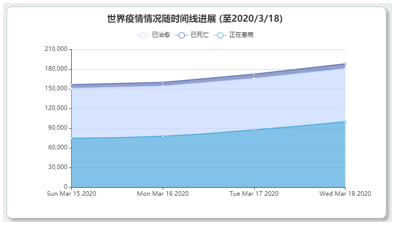

# 一、整体设计

## 1.1 表达主题

本系统以新冠疫情或其它重大公共卫生事件的相关数据为基础，利用可视分析相关技术和方法，探索并发现疫情大数据背后隐藏的模式和规律。

本系统主要表达以下两个主题：

1.疫情时空态势分析：利用可视分析技术，分析疫情时空分布模式、监控疫情发展态势、评估疫情防控措施。

2.疫情预测与舆情监测：利用可视分析技术，预测疫情发展趋势与关键节点、分析社交媒体话题与情感的动态演变、对社会舆情进行态势感知。

## 1.2 页面结构设计

本系统由两个页面构成，分别为中国板块页面和事件时间线页面。

图2——中国板块页面

图3——事件时间线页面

​    由上图可知，每一个页面都是多板块、多图表的样式。由于众多图表都统一在“一屏”之中，符合人的记忆规律。经过设计，即使图标数目较多，也不会有一种臃肿的感觉。

## 1.3 交互方式

 本系统的交互方式十分丰富。

中国板块页面的地图是可以进行交互点击的，由此来选择相应的地区；同时，也可以利用时间选择组件来选择时间；根据上述的地区和时间，所有的图表都会根据这些筛选条件进行动态的变化。

对于中国板块各种图表来说，也是可以进行交互的。对于同一图表不同的信息，可以自主的选择显示/隐藏，也可以通过图例来切换不同的视图。

事件时间线板块，右侧的时间线采用下拉式结构，因而交互方式只是向下拉动滚动条，此时新的事件新闻会根据时间进行动态的加载，同时，也会更新左侧的两个图表。

对于事件时间线页面的两个图标来说，交互主要是通过鼠标悬浮交互和视觉交互。比如说热点词Top10板块就会根据新加入的数据动态排序，实时展示最新最热的Top10词语。

# 二、前端部分具体实现

## 2.1 前端架构

前端采用的技术栈主要是Vue.js、Vue-Router、Vuex、Vue-Cli。

使用的组件UI库主要是ElementUI。

使用的可视化库主要是Echarts。

我们遵循了组件化开发的规范，将不同的试图分割为不同的模块。比如componens目录下即各种图表模块。

由于多图表数据使用高度耦合，因而我们使用Vuex来同一管理数据与数据流，实现了逻辑的统一。

最后，我们使用Vue-Cli脚手架帮我们快速构建前端项目。

## 2.2 中国板块页面

**2.2.1** **新闻模块**

 新闻模块如下图：

图4——新闻模块

​    整体样式采用时间线模型，从上到下。最上方新闻的时间是当前最新时间。每条新闻都有其标题、时间以及发表单位。每个标题都是可以点击的，会跳转到相应的新闻页面。

​    具体实现是通过Vue种的v-for循环渲染每一条新闻。具体就是将每数据对象的每一个属性都渲染出来，如标题、时间、发表单位等。

**2.2.2** **地图模块**

地图模块采用了leaflet框架，地图数据使用nodejs进行了数据的预处理。先通过全能地图下载器数据爬取获得谷歌的中国省级地理边界数据，导出的为各省的地理边界坐标的txt文件，将其整合到一个json文件中，对于整个数据采用了哈希结构的表达方式。

图5——地图坐标

使用Object.keys对哈希结构中的每一个属性（省级地区名称）进行遍历，然后使用L.polygon 函数进行省级区块多边形绘制并且加入了交互事件，向Vuex推送省级地区的名字，引起整个视图的联动交互。

最终效果如下：

图6——地图模块

**2.2.3** **概览模块**

概览模块主要有两个功能，分别是时间段的选择与数据概览。

对于时间段选择，我们采用了ElementUI的时间选择组件：

图7——时间选择组件

当我们点击这个组件时，可以选择相应的时间段：

​     

图8——时间选择

选择时间的同时，会向Vuex推送用户选择的时间。

​    概览也会发生相应的变化：

图9——概览模块

**2.2.4** **折线图模块**

​    折线图模块主要展示疫情的基本数据，例如确诊、死亡、治愈人数的走向图和走势图。同时，该图有两种模式，即当未选择地图的某个地区时，折线图展示的是全国的确诊、死亡、治愈人数数据；当选择了地图的某个地区时，折线图展示的是该地区的确诊、死亡、治愈人数数据。

图10——某地区数据折线图

图11——全国数据折线图

​    在实现方面，主要是调用EchartsAPI进行图表的绘制，实现同一坐标系下展示多条折线。并且我们添加了Zoom组件，可以手动的放大和缩小，使得视觉效果更加舒适。

​    在适配方面，由于每个显示器的分辨率都不一样，我们添加了监听器，使得图标在页面大小变化时，自动调整大小并重绘。

 

**2.2.5** **柱状图模块**

​    柱状图模块也有两种模式。

 第一种模式是当未选择地区时，展示的是以省为单位的确诊、死亡、治愈情况，在这种模式下，还有按钮可以切换，分别是按面积/按人口来统计。

图12——柱状图模式1

 第二种模式是选择了地区后，显示的就是某个省下属市的疫情情况：

图13——柱状图模式2

​    在实现方面，也是调用EchartsAPI进行图标绘制。这里也使用了Zoom组件，但是形式上与折线图不同，这里是通过手动拉动Slider进行缩放控制。

**2.2.6** **饼图模块**

​    饼图主要展示比例，本系统展示的是男性/女性患病年龄的分布比例。同样有按钮可以切换男性/女性。值得一提的是，该数据是通过爬取清华大学可视化网站而来的。

 

 图14——男性饼图

图15——女性饼图

## 2.3 事件时间线板块页面

**2.3.1** **下拉式时间线模块**

​    下拉式时间线模块效果如下：

图16——下拉时间线模块

​    首先，可以看出整条时间线是由一个个“内容卡片”排列而成。

对于每个卡片来说，它展现了三种信息，分别是新闻标题，新闻时间以及新闻摘要关键词。值得注意的是，新闻关键词是我们通过jieba分词库将新闻摘要提取而得。最后使用tag组件将其包装成美丽的样式。

由于该组件是可以下拉的，因此我们设计了动态加载的功能。即下拉完同一日期的新闻后，系统会自动加载新一天的数据，动态渲染新的卡片。其功能类似于图片懒加载，这既节省了首屏的渲染时间，又有效的提高了性能。还为动态折线图模块和热点词Top10模块提供了基础。

 如果只是动态加载，那么用户难以明显的区分出哪些卡片式哪个时间的数据，因而我们将时间线用颜色加以区分，同一颜色连接的时间线即为同一天的数据。

 图17——绿色与蓝色

图18——蓝色与红色

*2.3.2** **动态折线图模块**

 此图表与右侧时间线存在联动关系。当时间线中的endTime发生改变时，会调用后端世界疫情人口数据的接口，获得新的时序数据，将其存入到前端data层中。图表采用echarts进行绘制，通过grid属性设置图表的位置，legend表示图例，横坐标表示时间序列，可对data层中已有的世界疫情数据数据通过js数组的map方法得到。这里使用了堆叠折线图，我们将确诊人数分为了3类，包括死亡人数、治愈人数以及正在患病（非死非治愈的人数）。这样不仅能够横向对比得出疫情总的一个蔓延趋势，也能纵向看出患病人群中的治愈以及死亡比例。在右侧时间线往下滚动的时候，动线图会动态做出变化。

​     
 图19——变换前

图20——变换后

**2.3.3** **热点词Top10模块**

此图表与右侧时间线存在联动关系，数据直接取自于右侧时间线的分词数据，同样采用echarts进行绘制。在绘制之前，先要维护一个记录所有词汇频率的哈希表，这里需要使用双层循环，对时间线数据数组中每一个分词结果进行统计，如果哈希表中存在词汇记录，那么属性值就+1，若不是就新建一个属性，属性名为这个词汇，令其属性值为1。然后使用Object.keys进行属性遍历

 通过sort方法进行排序，再使用slice方法取前十，将此作为Top10图表的数据。然后在绘制图表的时候，加入了echarts自带的动画属性animation，实现出色的动画效果。在itemStyle当中使用函数实现自定义的配色效果。

  

图21——变换前

图22——变换后

# 三、后端部分具体实现

## 3.1 系统架构

后端采用node进行开发，使用express框架进行路由分发与请求监听

 本系统最大的优点是，采用对数据源文件的实时处理，无需额外的过多预处理操作。所以有更新的数据文件注入系统时，系统依然可以正常运行

## 3.2 接口设计

见[接口文档](接口文档.md)文件附录。

## 3.3 数据源 

来自于github上开源项目[2019新型冠状病毒疫情实时爬虫](https://github.com/BlankerL/DXY-COVID-19-Crawler)，数据来源为丁香园，包括了世界范围内以及国内疫情的死亡治愈患病数据、新闻数据、谣言数据等。

## 3.4 数据处理

**3.4.1** **中国板块新闻数据**

默认情况下，前端所需新闻数据为全国的国家性新闻，当前端请求参数中包括省的名字时，所需为省级新闻。观察源数据之后发现，新闻对象中有部分就包括了provinceName 这一属性，属性值包括中国各省名字以及全国字样。于是通过js中的数组filter方法进行条件筛选。新闻数据内因可能存在id值重复的新闻，所以还要针对id进行新数据对象的数组去重。

**3.4.2** **中国板块疫情人数统计**

前端在疫情人数这一块需要的是疫情人数的时序数据，而源数据文件中，同一天会有多条不同的数据，所以要根据更新的时间戳，将其转换为天以后进行数据去重。另外，在源数据中，3月15日为重要的分界点。在3月15日之前，只有中国国内各省的新闻数据，没有对中国患病总人数的直接全部统计。在那一天之后，因为引入了国际数据，所以有专门的针对中国总体情况的数据条目，其中条件为provinceName === '中国'。所以在这里，需根据前端请求参数中的起始日期和终止日期进行分类讨论。在3月15日之前，如果要获得全国的总数据，需要把各省数据做相加。所以需引入中国各省名字的字符串数组进行处理。另外在各省人数统计中，因为还需要省人口总数量以及省面积的数据，需要人工从网上查询资料获得。所以这一块数据接口有相当的工作量。

**3.4.3** **患病人口数量分布以及年龄情况**

本数据爬取自清华大学的疫情可视化分析系统。

**3.4.4** **国际新闻分词数据接口**

分词数据需要使用python的jieba模块进行预处理

python脚本直接对目录下的指定json文件进行处理，然后输出新的json文件。在使用python的json模块进行处理时，先使用json.load方法，将引入的json格式的字符串转换成为python的对象，其中包括了字典以及数组。对每一段文字进行前二十名的词汇提取。提取后发现，其中有不少中文的标点符号以及数字，还有“病例”、“新增”、“coronavirus”等必然的热点词汇会对分词结果构成影响。所以要进行条件过滤。